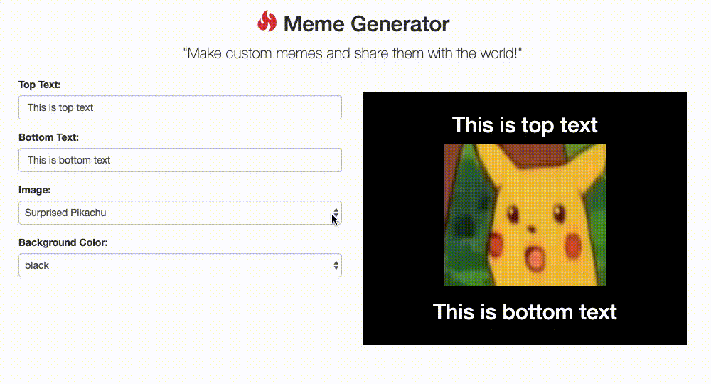

# Angular Meme Generator

This is a simple meme generator created primary using property binding in Angular.

This project was generated with [Angular CLI](https://github.com/angular/angular-cli) version 8.1.0.

## Development server

Run `ng serve` for a dev server. Navigate to `http://localhost:4200/`. The app will automatically reload if you change any of the source files.

